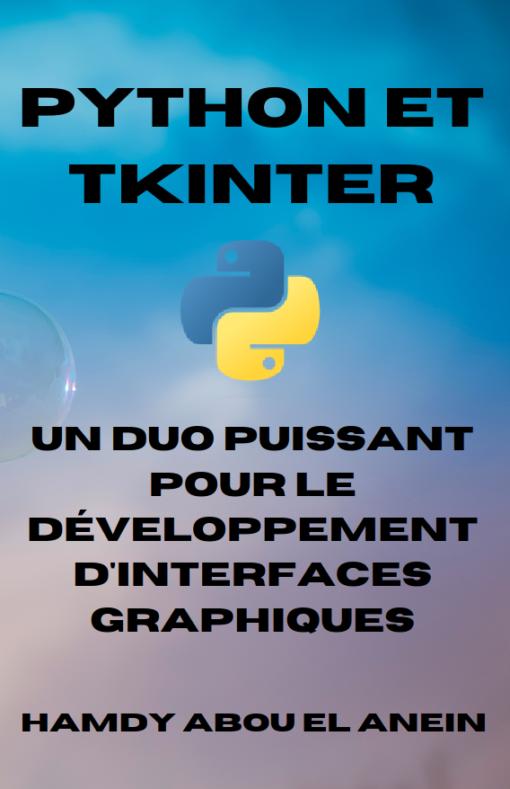

# Programmes du livre : [Python et Tkinter : un duo puissant pour le développement d'interfaces graphiques](https://www.amazon.fr/dp/B0C2RTBS6W)      
       

Auteur : [Hamdy Abou El Anein](https://www.amazon.fr/Hamdy-Abou-El-Anein/e/B0BM89T88X/ref=aufs_dp_fta_dsk)    
